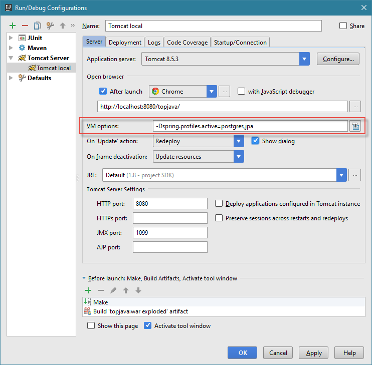
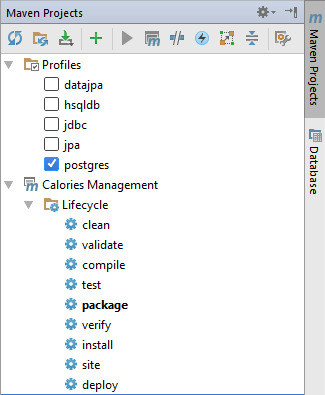

##Управление запуском приложения Topjava и тестов при помощи профилей MAVEN

Данная настройка позволит выбирать один из трех профилей БД API: **jdbc**, **jpa** и **datajpa**, и один из двух профилей БД: **hsqldb** и **postgres** для запуска приложения или тестов.

Приложение будет запускаться след. образом:
```
> mvn clean package -DskipTests=true cargo:run -P hsqldb,datajpa
```
или 
```
> mvn clean package -DskipTests=true cargo:run -P postgres,jdbc
```
После ключа -P через зяпятую указываются профили выбранные профили.

Если приложение уже собрано (package), то его можно запустить без лишних команд: 
```
> mvn cargo:run -P postgres,jdbc
```
Аналогичным образом запускаются тесты:
```
> mvn clean test -P postgres
```
или
```
> mvn clean test -P hsqldb
```
Для запуска тестов, профиль БД API указывать не нужно. 

Если не указывать профили явно, то будут использоваться профили по-умолчанию (в обоих случаях).
В данной настройке по-умолчанию используются профили: **hsqldb** и **datajpa**.
```
> mvn test
```
###Настраиваем pom.xml
```xml
<project>
    ...

    <properties>
        ...

        <customArg/>
        <argLine>${customArg} -Dfile.encoding=UTF-8</argLine>
    </properties>

    <profiles>

        <profile>
            <id>datajpa</id>
            <properties>
                <impl.profile>datajpa</impl.profile>
            </properties>
            <activation>
                <activeByDefault>true</activeByDefault>
            </activation>
        </profile>

        <profile>
            <id>jpa</id>
            <properties>
                <impl.profile>jpa</impl.profile>
            </properties>
        </profile>

        <profile>
            <id>jdbc</id>
            <properties>
                <impl.profile>jdbc</impl.profile>
            </properties>
        </profile>

        <profile>
            <id>hsqldb</id>

            <properties>
                <db.profile>hsqldb</db.profile>
                <db.groupId>org.hsqldb</db.groupId>
                <db.artifactId>hsqldb</db.artifactId>
                <db.context>src/main/resources/tomcat/context-hsqldb.xml</db.context>
                <customArg>-Dspring.profiles.active=hsqldb</customArg>
            </properties>

            <activation>
                <activeByDefault>true</activeByDefault>
            </activation>
        </profile>

        <profile>
            <id>postgres</id>

            <properties>
                <db.profile>postgres</db.profile>
                <db.groupId>org.postgresql</db.groupId>
                <db.artifactId>postgresql</db.artifactId>
                <db.context>src/main/resources/tomcat/context.xml</db.context>
                <customArg>-Dspring.profiles.active=postgres</customArg>
            </properties>
            <!--<activation>-->
            <!--<activeByDefault>true</activeByDefault>-->
            <!--</activation>-->
        </profile>
    
    </profiles>
    
    <build>
        ...
        
        <plugins>
            ...
                    
            <plugin>
                <groupId>org.apache.maven.plugins</groupId>
                <artifactId>maven-surefire-plugin</artifactId>
                <version>2.19.1</version>
                <configuration/>
            </plugin>
            
            <plugin>
                <groupId>org.codehaus.cargo</groupId>
                <artifactId>cargo-maven2-plugin</artifactId>
                <version>1.5.0</version>
                <configuration>
                    <container>
                        <containerId>tomcat8x</containerId>
                        <systemProperties>
                            <file.encoding>UTF-8</file.encoding>
                            <spring.profiles.active>tomcat,${db.profile},${impl.profile}</spring.profiles.active>
                        </systemProperties>
                        <dependencies>
                            <dependency>
                                <groupId>${db.groupId}</groupId>
                                <artifactId>${db.artifactId}</artifactId>
                            </dependency>
                        </dependencies>
                    </container>
                    <configuration>
                        <configfiles>
                            <configfile>
                                <file>${db.context}</file>
                                <todir>conf/Catalina/localhost/</todir>
                                <tofile>context.xml.default</tofile>
                            </configfile>
                        </configfiles>
                    </configuration>
                    <deployables>
                        <deployable>
                            <groupId>ru.javawebinar</groupId>
                            <artifactId>topjava</artifactId>
                            <type>war</type>
                            <properties>
                                <context>${project.build.finalName}</context>
                            </properties>
                        </deployable>
                    </deployables>
                </configuration>
            </plugin>
    
        </plugins>
        
    </build>
    
    <dependencies>
        ...

        <!--HSQLDB-->
        <dependency>
            <groupId>org.hsqldb</groupId>
            <artifactId>hsqldb</artifactId>
            <version>2.3.4</version>
        </dependency>

        <!--Postgres-->
        <dependency>
            <groupId>org.postgresql</groupId>
            <artifactId>postgresql</artifactId>
            <version>${postgresql.version}</version>
        </dependency>
        <dependency>
            <groupId>org.apache.tomcat</groupId>
            <artifactId>tomcat-jdbc</artifactId>
            <version>${tomcat.version}</version>
        </dependency>

        ...

    </dependencies>
</project>
```

###Добавляем ActiveProfilesResolver
Добавляем в приложение класс, который реализует интерфейс ActiveProfilesResolver
```java
import static ru.javawebinar.topjava.Profiles.HSQLDB;
import static ru.javawebinar.topjava.Profiles.POSTGRES;

public class SpringActiveProfileResolver implements ActiveProfilesResolver {
    @Override
    public String[] resolve(final Class<?> aClass) {
        final String property = System.getProperty("spring.profiles.active");
        String profile;
        if (property != null) {
            profile = property.contains(HSQLDB) ? HSQLDB : POSTGRES;
        } else {
            profile = HSQLDB;
        }
        return new String[]{profile};
    }
}
```
###Используем аннотацию @ActiveProfiles
Добавляем аннотацию @ActiveProfiles с этим классом к базовому классу всех тестов
```java
@ContextConfiguration({
        "classpath:spring/spring-app.xml",
        "classpath:spring/spring-db.xml"
})
@RunWith(SpringJUnit4ClassRunner.class)
@ActiveProfiles(resolver = SpringActiveProfileResolver.class)
@Sql(scripts = "classpath:db/populateDB.sql", config = @SqlConfig(encoding = "UTF-8"))
abstract public class AbstractServiceTest {
    ...
}
```
###Настраиваем IDEA
Чтобы запускать приложение внутри IDEA с разными конфигурациями и, при этом, не вносить изменения в код, в опциях VM настройки запуска приложения указываем необходимые профили
```
-Dspring.profiles.active=postgres,jpa
```
 

Если не указывать профили, то при запуске приложения в IDEA будут использованы профили по умолчанию из **web.xml**:
```
    <context-param>
        <param-name>spring.profiles.default</param-name>
        <param-value>hsqldb,datajpa</param-value>
    </context-param>
```
Желательно здесь настроить профили идентичные тем, которые выбраны по-умолчанию в **pom.xml**.

###Запуск тестов в IDEA
При запуске отдельного теста или тестового класса в IDEA, для выбора профиля БД используем Maven tool  


###Рабочий пример 
https://github.com/Cepr0/topjava/tree/HW06
